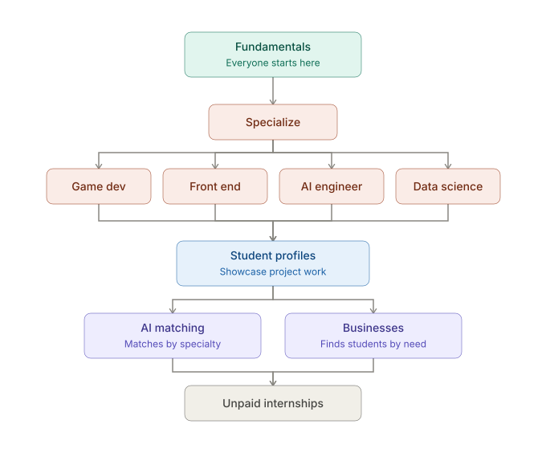

# Forked

The learning platform for DevOps Club. Members learn (or review) the basics of CS, specialize in the track they're interested in, build a profile of real project work, and get matched to an internship at the end.

> **Why "Forked"?** Like forking a repo — everyone starts from the same base (fundamentals), then the path forks into the specialization each member chooses.

> **Status:** Idea / planning stage. Nothing is built yet — this README documents the vision and roadmap for the officers working on it.

## How it works

1. **Fundamentals** — everyone starts here. CS basics (programming fundamentals, data structures, git, terminal) plus web basics (HTML/CSS/JS, how the web works).
2. **Specialize** — members pick one of four tracks:
   - **Game dev**
   - **Front end**
   - **AI engineer**
   - **Data science**

   Each track pairs with an entry-level **industry certification** (for example GitHub Foundations for fundamentals, Azure AI Fundamentals for the AI track). Prep happens in-platform; the exam is taken with the vendor; the credential goes on the profile.
3. **Student profiles** — project work from the track, plus any certifications earned, becomes a portfolio profile that showcases what the member can actually do.
4. **Matching** — profiles connect members to **unpaid internships**, either through **AI matching** (pairs students with opportunities by specialty) or **businesses** browsing profiles for the skills they need. The exact matching mechanics are still being figured out.

## Learning format

Every lesson has two halves, and nothing sends the student to an outside site to learn:

- **Learn (web)** — a short, interactive explanation of the concept, Brilliant-style: one idea per screen with something to predict, fill in, or reorder before moving on. Not video-then-quiz.
- **Do (in the real tool)** — a Forked companion extension inside VS Code (or Godot for game dev) guides the student step by step, checks each step against the actual project state, and pops up the next thing to do. Real terminal, real git, real runtime.

The web app is also home base: the learning path, progress, the student profile, and matching. Full learning design is in [docs/learning-model.md](docs/learning-model.md). The shared visual and interaction system is in [docs/design-system.md](docs/design-system.md), with implementation values in [docs/design-tokens.json](docs/design-tokens.json).

Lessons are club-authored. External resources are reference material for authors; content is only incorporated directly when its license permits it (public domain or MIT-licensed).

## Planned tech stack

- **Next.js** + **React** + **TypeScript**
- **Tailwind CSS** with **shadcn/ui** (Radix)
- **Clerk** for auth (student and business accounts)
- **Zod** for validation
- **Vercel** for hosting (free tier, `*.vercel.app`)
- **AWS DynamoDB** for profiles and curriculum data
- **PostHog** for analytics
- **Vitest** for testing
- **npm** as the package manager
- **VS Code extension** (TypeScript, VS Code Extension API) for the in-editor Do half
- **Godot editor plugin** (GDScript) for the game dev track

## Roadmap

Near-term focus, in order:

1. **Define the curriculum** — nail down the fundamentals content and the four track outlines; decide the Learn blocks and Do steps each lesson uses (see [docs/learning-model.md](docs/learning-model.md)).
2. **Build the MVP** — student accounts, the web Learn half with the path map, the VS Code extension for the Do half, and the onboarding, git, and JS fundamentals modules.
3. **Then** — the remaining fundamentals modules, the Godot plugin, project profiles, and the fundamentals → specialize flow.
4. Later: business accounts, profile browsing, and the AI matching layer.

## For officers & contributors

This repo is where the platform gets built. While we're in planning:

- Curriculum ideas and track outlines go in `docs/`.
- Open an issue to propose changes to the flow above before building against it.
- Big decisions still open: what devices members have (the Do half needs desktop VS Code), which certification the game dev track uses and who pays for exams, matching mechanics (AI vs. manual browse vs. both), and how businesses onboard. See the open decisions in [docs/learning-model.md](docs/learning-model.md).

## License

See [LICENSE](LICENSE).
